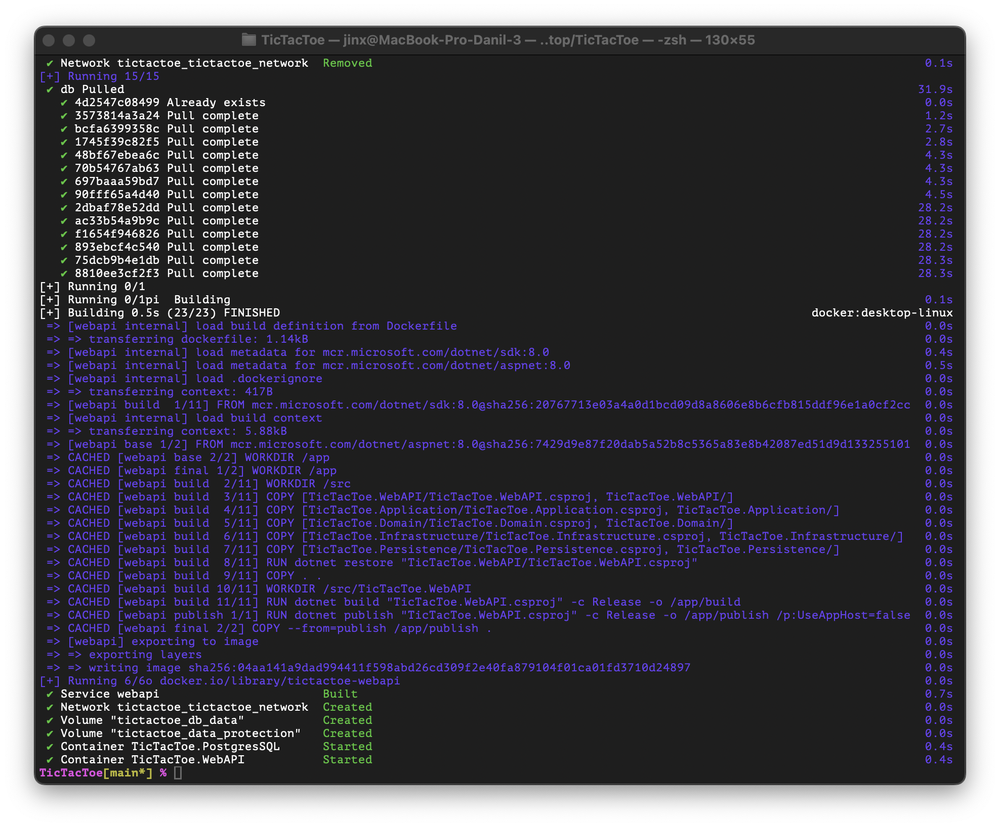

# Крестики-нолики

### <i>Условия: </i>

Создатель игры сидит и ждет когда кто-то к нему присоединится. Когда игрок2 присоединился, игра стартует автоматически. Кто первый, определяется рандомно. Должна соблюдаться очередность хода - т.е. ходят строго по очереди. Любой кто подключился (игрок3 и так далее) не могут вмешаться в игру, а только наблюдают (видят чат, если он есть).  

После окончания игры игрокам нужно начислить рейтинг:
<i>
- за победу, +3 победителю
- за ничью, +0 каждому
- за поражение, -1 проигравшему  
</i>

После окончания игры игра должна перезапуститься через несколько секунд и продолжиться с теми же участниками.

### <i>Детали разработки:</i>

Все должно быть сделано в одном “компоузнике”. Должно быть (использование каждого обязательно для полного балла):
<i>
- UI - react

- бэк для UI (WebApi) - обязательно CQRS (MediatR - Запрещен, нужно самописный), DDD - по желанию

- бд - на выбор MSSQL, PostgreSQL

- rabbit - для взаимодействия игры 

- rabbit consumer - для взаимодействия игры

- mongo - для сохранения рейтинга

- SignalR - для чата и взаимодействия игры

- по желанию добавить отдельный сервис который закрывает пустые комнаты или придумать свою реализацию. “Закрывает” - ставит статус “окончено”
</i>

### Как запускать проект:

Весь проект запускается с помощью `docker-compose`. 

Чтобы полностью пересобрать проект, можно воспользоваться командами: 

```shell
docker-compose down --rmi all -v
docker-compose up --build -d
```

также были добавлены сценарии для сборки через `Makefile`:

```shell
make docker
```

```shell
make docker-rebuild
```

После выполнения команд результат должен быть примерно таким: 

